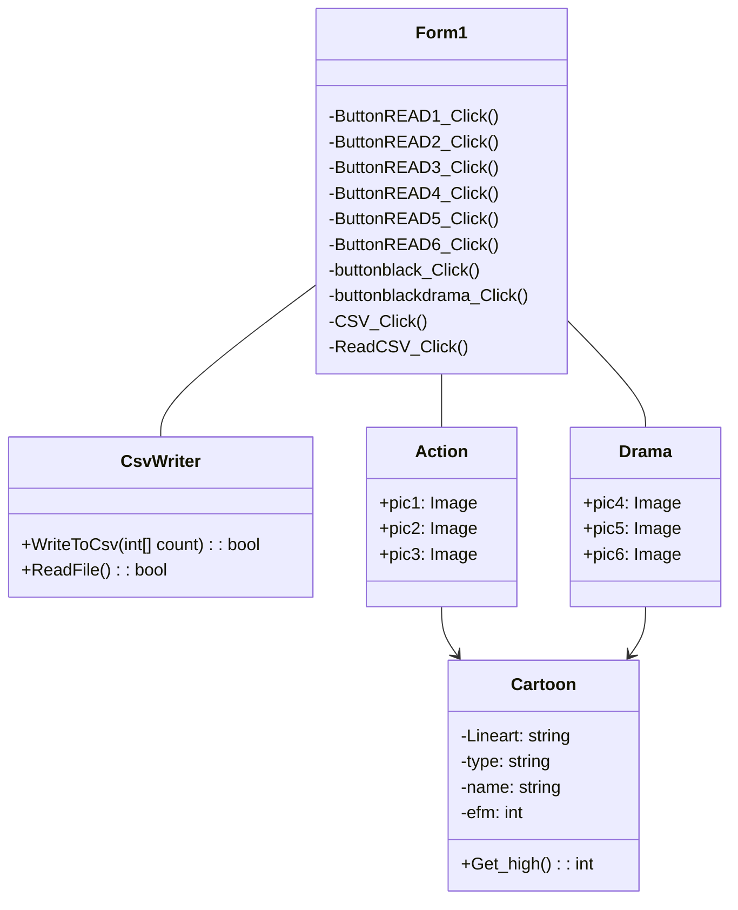

ความเป็นมา : ด้วยความส่วนตัวแล้วผมเป็นคนชอบดูอนิเมะแล้วอนิเมะก็ช่วยเติมเต็มชีวิตของผมได้ผมเลยอยากจะแนะนำสิ่งดีๆให้คนอื่นได้รู้จักอนิเมะมากขึ้น

วัตถุประสงค์ของโปรแกรม : ผมอยากจะแนะนำอนิเมะเพื่อให้คนอื่นได้ผ่านชั่วเวลาที่เลวร้ายสำหรับใครบางคนได้

โครงสร้างของโปรแกรม (Class diagram) ของโปรแกรม ใช้ Mermaid ในการเขียน : 

ชื่อของผู้พัฒนาโปรแกรม : นายจิรกิตติ์ โลหะวาทิน 
รหัส นศ. : 663450173-3 
